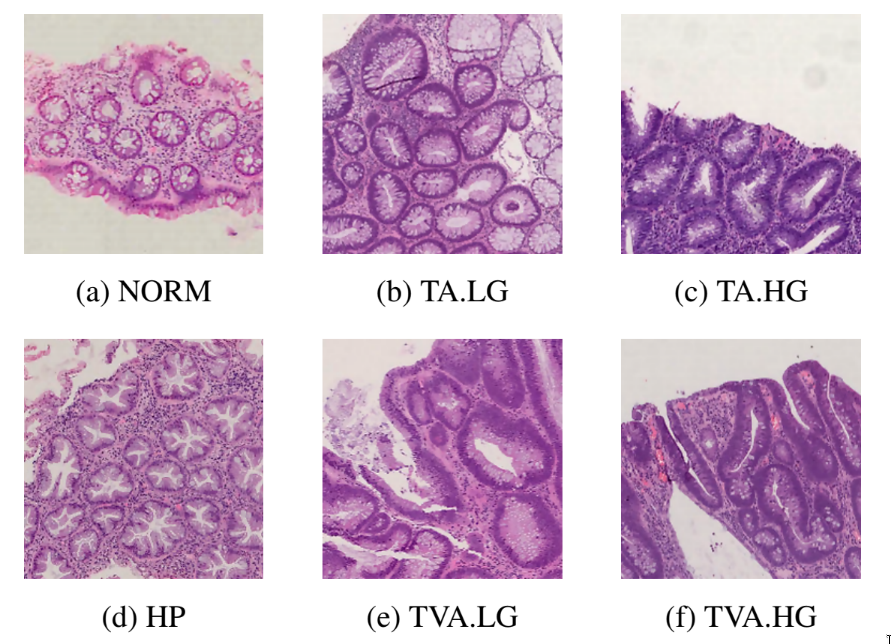

# UNITOPATHO

*UniToPatho* is an annotated dataset of **9536** hematoxylin and eosin stained patches extracted from 292 whole-slide images, meant for training deep neural networks for colorectal polyps classification and adenomas grading. The slides are acquired through a Hamamatsu Nanozoomer S210 scanner at 20× magnification (0.4415 μm/px). Each slide belongs to a different patient and is annotated by expert pathologists, according to six classes as follows:

- **NORM** - Normal tissue;
- **HP** - Hyperplastic Polyp;
- **TA.HG**- Tubular Adenoma, High-Grade dysplasia;
- **TA.LG** - Tubular Adenoma, Low-Grade dysplasia;
- **TVA.HG** - Tubulo-Villous Adenoma, High-Grade dysplasia;
- **TVA.LG** - Tubulo-Villous Adenoma, Low-Grade dysplasia.

## Downloading the dataset

You can download UniToPatho from [IEEE-DataPort](https://ieee-dataport.org/open-access/unitopatho)
