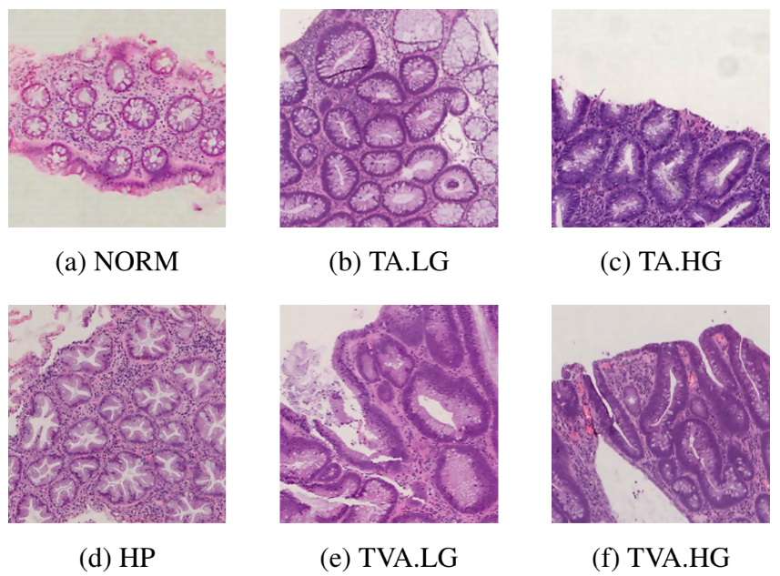

# UNITOPATHO



*UniToPatho* is an annotated dataset of **9536** hematoxylin and eosin stained patches extracted from 292 whole-slide images, meant for training deep neural networks for colorectal polyps classification and adenomas grading. The slides are acquired through a Hamamatsu Nanozoomer S210 scanner at 20× magnification (0.4415 μm/px). Each slide belongs to a different patient and is annotated by expert pathologists, according to six classes as follows:


- **NORM** - Normal tissue;
- **HP** - Hyperplastic Polyp;
- **TA.HG** - Tubular Adenoma, High-Grade dysplasia;
- **TA.LG** - Tubular Adenoma, Low-Grade dysplasia;
- **TVA.HG** - Tubulo-Villous Adenoma, High-Grade dysplasia;
- **TVA.LG** - Tubulo-Villous Adenoma, Low-Grade dysplasia.


## Downloading the dataset

You can download UniToPatho from [IEEE-DataPort](https://ieee-dataport.org/open-access/unitopatho)

## Dataloader and example usage

We provide a [PyTorch compatible dataset class](/unitopatho.py) and [ECVL compatible dataloader](/unitopatho_ECVL.py).
For example usage see [Example.ipynb](/Example.ipynb)

## Citation

If you use this dataset, please make sure to cite the [related work](https://arxiv.org/abs/2101.09991):

[](https://paperswithcode.com/sota/on-unitopatho?p=unitopatho-a-labeled-histopathological)

```
@article{barbano2021unitopatho,
  title={UniToPatho, a labeled histopathological dataset for colorectal polyps classification and adenoma dysplasia grading},
  author={Barbano, Carlo Alberto and Perlo, Daniele and Tartaglione, Enzo and Fiandrotti, Attilio and Bertero, Luca and Cassoni, Paola and Grangetto, Marco},
  journal={arXiv preprint arXiv:2101.09991},
  year={2021}
}
```

and the dataset entry

```
@data{9fsv-tm25-21,
  doi = {10.21227/9fsv-tm25},
  url = {https://dx.doi.org/10.21227/9fsv-tm25},
  author = {Luca Bertero; Carlo Alberto Barbano; Daniele Perlo; Enzo Tartaglione; Paola Cassoni; Marco Grangetto; Attilio Fiandrotti; Alessandro Gambella; Luca Cavallo },
  publisher = {IEEE Dataport},
  title = {UNITOPATHO},
  year = {2021}
}
```
